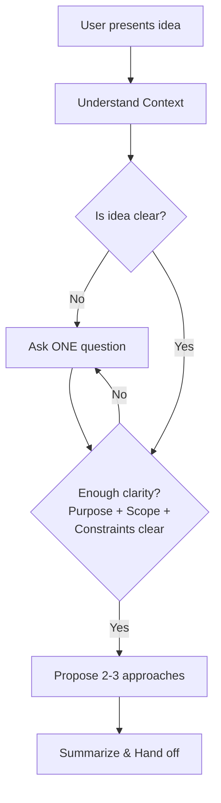

# Brainstorming Ideas

Clarify ideas and requirements through collaborative dialogue before handing off to other workflows.

## Decision Tree



## Workflow

Think step-by-step through these phases:

### 1. Understand Context

- Check project state (files, docs, recent commits)
- Identify existing patterns, constraints, and conventions
- Note related functionality that might be affected

### 2. Explore the Idea

Ask questions one at a time until you understand:

| Dimension | Key Questions |
| --------- | ------------- |
| Purpose | What problem does this solve? Who benefits? |
| Scope | What's in vs out? What's the minimum viable version? |
| Constraints | Technical limitations? Dependencies? Integration points? |
| Success | How do we know it works? What does "done" look like? |

**Question strategies:**

- Multiple choice when possible (lower cognitive load)
- Open-ended for exploring unknowns
- "What if..." for edge cases
- "How important is..." for prioritization
- "What would happen if we didn't..." for necessity checks

### 3. Propose Approaches

Once the idea is clear, propose 2-3 approaches:

- Lead with your recommended option and explain why
- Present trade-offs honestly (complexity, maintainability, performance)
- Consider existing patterns in the codebase
- Apply YAGNI - challenge any unnecessary scope

### 4. Summarize and Hand Off

Provide a clear summary for the next workflow:

```markdown
## Summary

**Approach:** [Selected approach]

**In scope:**
- [Feature 1]
- [Feature 2]

**Out of scope:**
- [Explicitly excluded item]

**Open questions:**
- [Risk or uncertainty to monitor]

**Next steps:** [What workflow to use next]
```

## Example Dialogue

**Good:**

```text
User: I want to add notifications to the app

Claude: Before we dive in, let me understand the goal better.
What kind of events should trigger notifications?

A) User actions (someone liked your post, new follower)
B) System events (payment processed, subscription expiring)
C) Both user actions and system events
D) Something else

User: A - just user actions for now

Claude: Got it - user action notifications only. For delivery,
which is most important to start with?

A) In-app notifications (bell icon with dropdown)
B) Push notifications (mobile/desktop)
C) Email notifications
D) Multiple channels

User: A - in-app first, we can add others later

Claude: Perfect. So in-app notifications for user actions.
One more question: should users be able to customize which
notifications they receive, or show everything initially?
```

**Bad:**

```text
User: I want to add notifications to the app

Claude: Great idea! Here's what we need to consider:
1. What events trigger notifications?
2. How should they be delivered?
3. Should they be real-time or batched?
4. What about notification preferences?
5. How long should we store them?
6. Should there be notification groups?

Also, we should think about the database schema,
the WebSocket implementation, and the UI components...
```

## Rules

- **One question at a time** - Never ask multiple questions in one message
- **Multiple choice preferred** - Lower cognitive load than open-ended
- **YAGNI ruthlessly** - Challenge every feature, remove unnecessary scope
- **Explore alternatives** - Always propose 2-3 approaches before settling
- **Be flexible** - Circle back when something doesn't make sense
- **Stay curious** - Dig deeper when answers reveal complexity
- **Hand off cleanly** - Summary must be actionable for the next step

## Anti-Patterns

| Bad | Why | Good |
| --- | --- | ---- |
| Asking 5 questions at once | Overwhelming, gets partial answers | One focused question per message |
| Jumping to solution | Misses requirements, causes rework | Explore the problem space first |
| Only proposing one approach | No trade-off discussion | Always offer 2-3 options |
| Vague summary | Next workflow lacks context | Specific decisions and scope |
| Accepting scope creep | Delays delivery, adds complexity | Challenge additions with YAGNI |
| Assuming you understand | Builds wrong thing | Confirm understanding before proposing |
